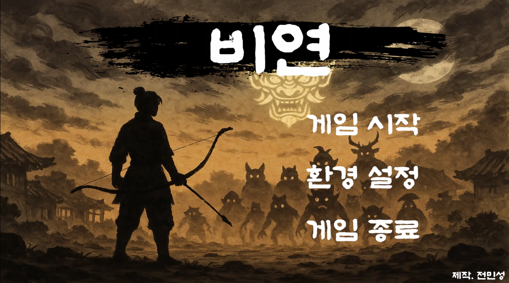
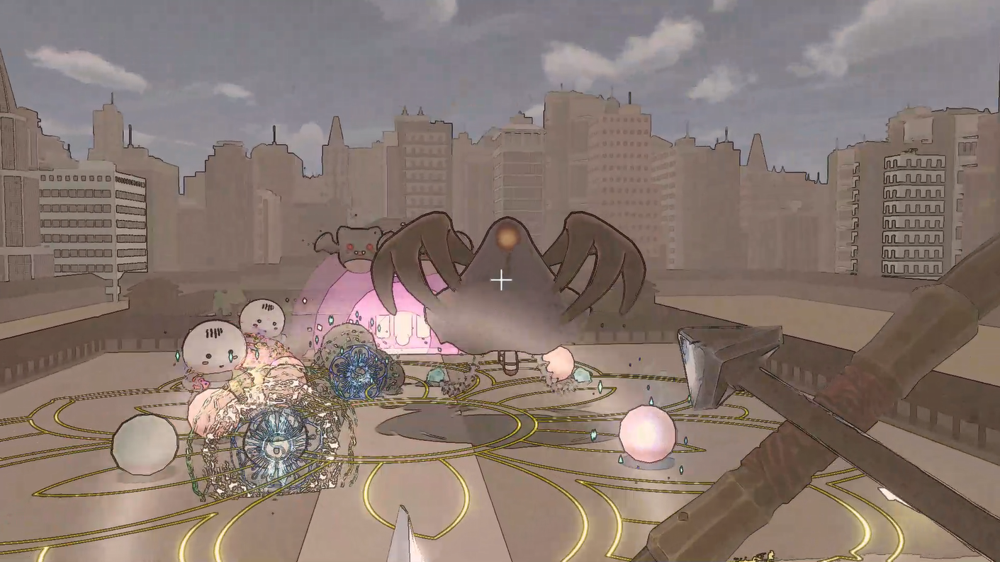
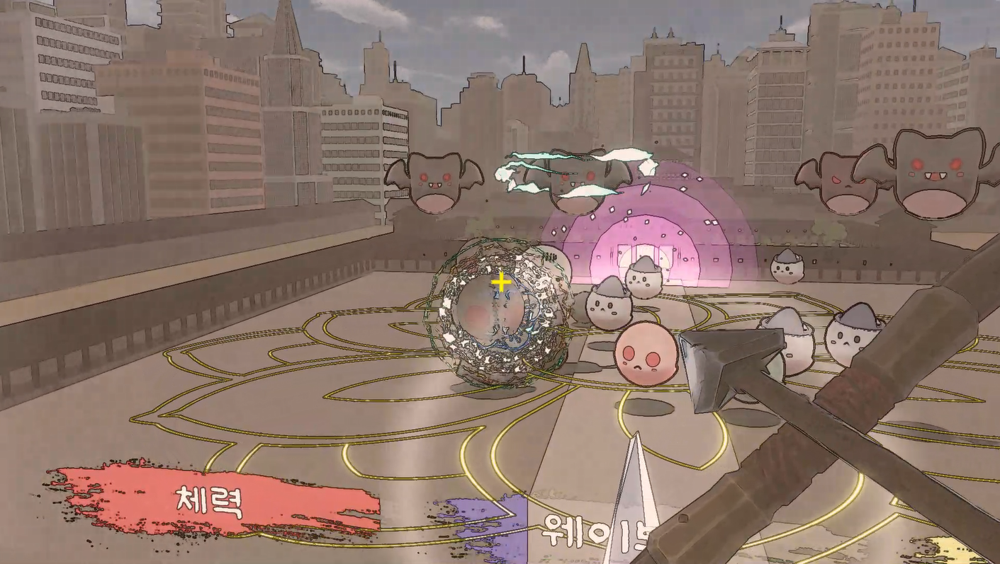
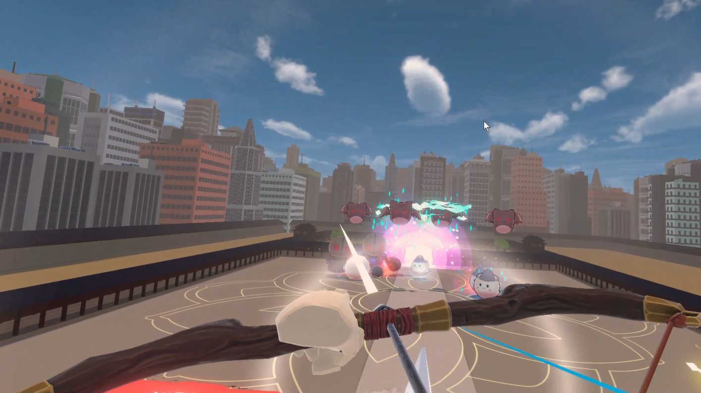
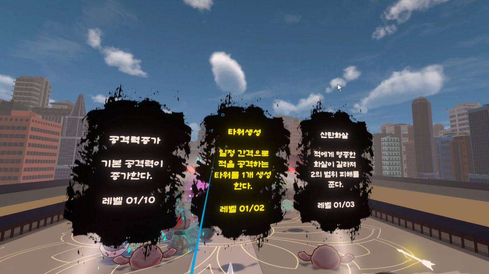
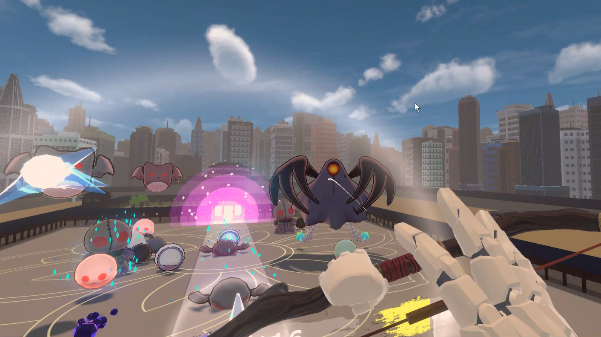

# 비연 (BIYEON) - 飛燕

> 전통과 현대를 배경으로 몰려오는 적들을 활을 이용해 처치하는 VR 및 PC 게임

## 🎮 특징
- Meta Quest 지원
- 7종류의 스킬
- 20 웨이브 스테이지
- VR 및 PC 버전 모두 제공

## 🛠️ 개발 정보
- Engine: Unity 6000.0.35f1 (URP)
- Language: C#

## 📷 스크린샷

## 몬스터 정보
- 망령( 亡靈 ) / Shade
    
    죽고 난 뒤 윤회의 고리에 들어가지 못하고 오랫동안 지상을 떠돌다 모든 걸 잊어버리고 떠돌아 다니는 존재
    
- 원귀 ( 寃鬼 ) / Ghost
    
    억울하게 누명을 쓰거나 다른 사람의 악의로 인해 감옥에 갇혀서 그곳에서 죽거나 처형당해 한을 품고 떠도는 귀신

- 야박 ( 夜蝠 ) / Bat
    
    밤의 박쥐 요괴

- 낙서귀( 落鼠鬼 ) // 낙삼(움직이는 옷) + 무서(박쥐 요괴) + 원귀(귀신) / Clothes ghost
    
    억울하게 죽은 혼이 옷에 깃들어 형체를 잃고 떠도는 존재. 원래 한복을 입고 있었지만, 점차 형체가 사라지면서 박쥐처럼 날개가 돋아났음

## 개발 과정
- 2025.02.27
    - 활
    
    활 오브젝트에 Collider, Rigidbody 컴포넌트 추가
    
    AutoHand의 Grabbable, Grabbable Pose 스크립트 추가
    
    Grabbable의 Single Hand Only를 체크해서 한 손으로만 잡을 수 있도록 한다.
    
    Hand Type을  사용하면 잡을 수 있는 손을 제한 할 수 있다.
    
    Grabbable Pose의 Editor Hand를 사용하면 해당 오브젝트를 잡을 때 손의 모양을 제한 할 수 있다.
    
    - 활 시위
    
    활 시위 오브젝트에 Collider 컴포넌트 추가
    
    AutoHand의 Grabbable, Grabbable Held Joint 스크립트 추가
    
    활 시위 오브젝트는 활의 자식 오브젝트 이므로 Grabbable의 Body에 부모 오브젝트의 Rigidbody를 지정한다.
    
    Grabbable의 Show Events에서 OnGrab()과 OnRelease()에 이벤트를 할당해 시위를 잡았을 때와 놓았을 때 코드가 실행되도록 한다.
    
    시위를 잡으면, 화살이 보이고 활의 시위의 당겨짐에 따라 화살이 날라갈 예상 궤적이 보인다.
    
    시위를 놓으면, 예상 궤적을 따라 화살이 날아가게 된다.
    
    Grabbable Held Joint의 Connected Grabbable에도 부모 오브젝트의 Grabbable을 지정한다.
    
    해당 스크립트는  오브젝트를 집었을때 움직일 수 있는 방향 및 거리를 제한 할 수 있다.
    
    활 시위에서는 X MinLimit을 -0.25로 제한하여 활 시위를 당기는 것 외에는 불가능하게 설정했다.
#
- 2025.02.28
    - PC 버전 활 제작
    
    1인과 3인칭으로 변경 기능 추가 ( ’V’키로 변경 가능 )
    
    Camera의 Culling Mask 기능 사용해서 1인칭 시 플레이어가 보이지 않도록 수정
    
    1인과 3인칭에 따른 활 변경
    
    대기, 기본 이동, 조준, 조준 중 이동 애니메이션 추가
    
    이동 애니메이션은 Blend Tree를 사용해 이동 방향에 따른 애니메이션 수정
    
    조준 애니메이션은 Blend Tree를 사용해 공격 속도에 따른 애니메이션 속도 변경
    
    문제점 : 조준 중 시점(카메라)의 상하 움직임에 따른 활의 움직임 없음
#
- 2025.03.01
    - PC 버전의 1인칭 & 3인칭 시점 제작
    
    ‘V’ 버튼으로 카메라 시점 변경 가능
    
    3인칭 시점에서 조준할 시 자연스럽게 줌이 되는 기능 추가
    
    1인칭과 3인칭에서 카메라를 상하로 움직일시 플레이어 및 활이 카메라를 따라가도록 제작
    
    3인칭 상태에서 Layer가 Wall인 오브젝트와 가까워지면 카메라가 벽을 뚫지 않도록 제작
    
    1인칭 상태에서의 활이 좀더 자연스럽게 보이도록 수정
    
    - PC 버전 화살 발사 제작
    
    공격 속도에 맞게 마우스를 누르고 조준 게이지를 전부 채우면 발사된다.
    
#        
- 2025.03.02
    - PC 버전
    
    활 시위를 당길 시의 효과음 추가
    
    화살을 발사할 때의 효과음 추가
    
    활 시위를 당기고 다 당겼을 시의 UI 효과 추가
    
    stickingArrow Prefab에 AudioSource를 추가함으로 화살이 벽, 장애물, 목표에 명중했을시 효과음 추가
    
    AudioMixer 추가함으로 Master, BGM, SFX로 오디오 구분 가능
#    
- 2025.03.03
    
    VR에서 화살을 발사 할때의 효과음 추가
    
    VR에서 활을 분실 했을 때를 대비하여 오큘러스 기준 버튼 ‘X’를 누르면 왼손에 활을 소환하는 기능을 추가
#    
- 2025.03.13
    
    맵 추가
#    
- 2025.03.18
    
    망령, 원귀의 애니메이션 컨트롤러 추가
    
    몬스터의 기본 스크립트 작성
    
    플레이어를 향해 이동, N회 화살에 피격시 사망 애니메이션 재생 및 5초후 사라짐
    
    추후, 사라지는 이펙트 추가 필요
#   
- 2025.03.20
    
    게임 스타일 변경 : 1인칭 뱀서 → 1인칭 디펜스
    
    공격력 강화 제작
    
    이중 화살 제작
    
    전류 화살 제작 ( 체인 화살 → 전류 화살로 변경 / 전기 마테리얼 혹은 파티클 필요 )
    
    빙결 화살 제작 ( 이동속도 수치를 직접 입력해야함 수정 필요 )
    
    플레이어 레벨업 제작 ( 경험치 테이블 수치 기획 필요 )
    
    몬스터 스폰 시스템 제작
#   
- 2025.03.22
    
    기존 맵은 VR에서 실행시 프레임 드랍이 심하게 일어나 로우폴리 디자인의 맵으로 변경
    
    PC모드의 1인칭 시점 높이를  VR모드에서와 동일하게 변경 ( 추후 테스트에 따라 변경 가능 )
    
    PC모드에서 화살이 날아가는데 화살이 일직선으로 날아가지 못하거나 카메라가 바라보고 있는 방향으로 날아가지 않고 엉뚱한 방향으로 날아가는 현상 발견 - > 수정 완료
    
    VR에서도 공격력 증가, 체인 화살, 연발 화살 기능이 정상적으로 작동하는 것을 확
#   
- 2025.03.27
    
    WorldSpace에서의 웨이브, 플레이어 레벨, 체력의  UI제작
    
    PC버전에서의 플레이어 스킬 선택 UI 제작
    
    플레이어가 맵 바깥으로 빠지지 않도록 콜라이더 수정
    
    망령의 이동속도는 1.5 원귀의 이동속도는 1로 설정
    
    레벨업이 시간이 정지되며 플레이어가 스킬을 선택하면 적용되도록 수정
    
    몬스터의 목적지를 플레이어에서 직선방향으로 이동하도록 수정
    
    몬스터 밀림현상 (목적지에 도착한 몬스터의 수가 많아지면 서로 밀면서 벽을 뚫음)
    
    → NavMeshAgent의 Quality를 LowQuality로 변경함으로 해결
#   
- 2025.03.29
    
    플레이어 스킬 선택 UI 텍스트가 등장 시 선택할 수 있는 스킬과 설명이 랜덤으로 등장
    
    스킬 선택화면에서는 활의 조준점이 안보이도록 수정
    
    활 조준중 레벨업을 할 시 스킬 선택 후 조준 애니메이션이 이어서 재생되는 오류 수정
    
    플레이어(보호막)의 체력이 0이 될시 게임오버 화면이 나타며 타이틀 씬으로 이동한다.
    
    마지막 웨이브에 도달하고 남아있는 모든 몬스터를 처치하면 게임클리어가 된다.
#   
- 2025.04.02
    
    몬스터의 기본 이동속도 조정 1 → 4 // 기존의 이동속도가 너무 느려서 긴장감이 부족함
    
    몬스터의 기본 체력 상향 및 2웨이브 당 기본 체력이 증가 // 플레이어는 강해지지만 몬스터의 체력은 그대로라 난이도가 너무 쉬워지는 것을 방지
    
    플레이어의 레벨 제한을 20으로 설정 // 모든 스킬의 만렙을 찍을 수 없으니 전략적인 선택이 필요
    
    플레이어의 레벨이 20이 되면 레벨 UI의 경험치 게이지가 가득찬 상태로 표시되도록 수정
    
    웨이브 당 시간은 60초로 설정
    
    웨이브가 넘어갈때 10마리의 몬스터가 즉시 생성
    
    레벨업 후 스킬 선택시 해당 능력치 및 효과가 적용
#   
- 2025.04.03
    
    인게임 씬으로 씬이 전환된 후 바로 게임이 시작되지 않고 ‘F’키를 누른 후 게임을 시작할 수 있도록 변경
    
    환경설정 UI 제작
#   
- 2025.04.04 ~ 04.10
    
    화살이 적에게 명중시 이펙트 발생
    
    폭발 화살 → 확산 화살로 변경 (효과는 비슷) 해당 이펙트 제작
#   
- 2025.04.11 ~ 04.17
    
    엘리트 몬스터 추가
    
    5웨이브 마다 출현
    
    일반 몬스터보다 많은 체력을 가지고 있음
#   
- 2025.05.18 ~ 04.24
    
    인트로 글 추가
    
    타이틀 화면 변경 및 타이틀 애니메이션 추가
    
    레벨업시 등장하는 스킬 선택창 애니메이션 추가
    
    보호막을 생성하는 크리스탈 오브젝트 추가 (꾸미기 용)
    
    조작 가이드 월드 캔버스에 추가
#   
- 2025.04.25 ~ 05.08
    
    체력 재생 스킬 추가 (보호막의 체력이 5초당 스킬레벨 * 5 만큼 회복 )
    
    터렛 스킬 추가 → 터렛이 적을 공격하는 기능까지 구현
#   
- 2025.05.09 ~ 05.22
    
    적 명중시 나타나는 피격 이펙트 변경
    
    타워생성 스킬 추가 ( 일정간격마다 적을 공격하는 타워를 최대 2개 생성한다 )
    
    화면에 전체적인 노란색 조명 추가 및 종이 질감 텍스쳐 추가
    
    → 좀더 동양풍 및 분위기에 맞는 효과를 주기 위함
#   
- 2025.05. 23 ~ 05.29
    
    VR 연동
    
    VR 시작시 시작 맵 제작 필요
    
    VR에서의 렌더링 방식이 PC와 달라서 쉐이더가 적용이 되지 않음
#   
- 2025.05.30
    
    VR 시작 맵 디자인 추가
    
    VR 소리 환경설정 기능 추가
    
    맵 비주얼 요소 추가
#   
- 2025.05.31
    
    몬스터 원거리 공격 추가
    
    원거리 공격 오브젝트 2 종류 추가
    
    몬스터 원거리 공격 이펙트 추가
    
    엘리트 몬스터 공격 이펙트 추가
    
    박쥐 몬스터 공격 이펙트 추가
